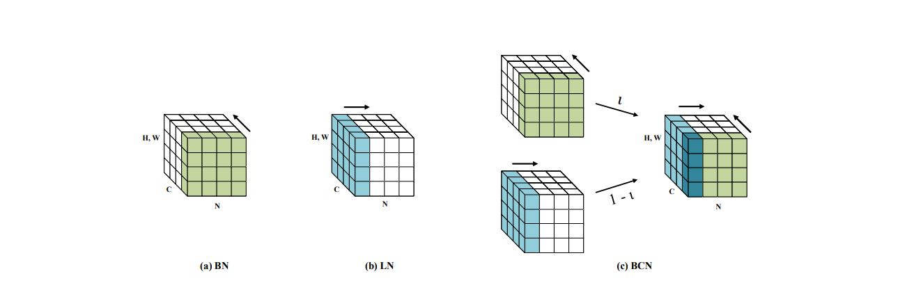
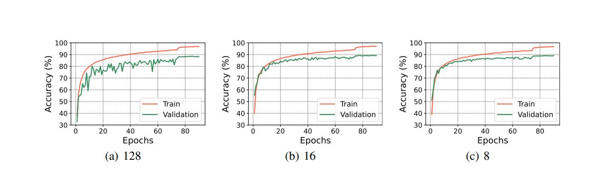

# BCN: BATCH CHANNEL NORMALIZATION

([Link for the paper ](https://arxiv.org/abs/2312.00596))
  

This repository contains the pytorch   of the model we proposed in our paper:  BCN: BATCH CHANNEL NORMALIZATION

The code is available in pytorch. To run the project kindly refer to the individual readme file.

## Dataset

CIFAR10/100 (Krizhevsky et al., 2009), SVHN (Netzer et al., 2011), and ImageNet (Russakovsky et al., 2015)

## Proposed Normalization technique

### Visualization on several normalization techniques. Each subplot shows a feature map tensor with N the batch axes, C the channel axes, and (H, W) the spatial height and width axes.

#### Read our paper for further details

##   Requirements
####  Programming language

The code has been written in pytorch  and requires
torch
scipy,
numpy.

## Some results from our paper

####  Validation accuracy of different normalization techniques on (a) CIFAR-10, (b) CIFAR 100, (c) SVHN.

## Contact

####  You can mail us at: 

#### Afifa Khaled 

afifakhaied@tju.edu.cn

#### Chao Li

D201880880@hust.edu.cn

#### Jia Ning

ninja@hust.edu.cn

#### Kun He
brooklet60@hust.edu.cn

## If you use this code for your research, please consider citing the original paper:

We have submitted the manuscript to CVPR conference 2024 in 011/2023

@misc{khaled2023bcn,
      title={BCN: Batch Channel Normalization for Image Classification}, 
      author={Afifa Khaled and Chao Li and Jia Ning and Kun He},
      year={2023},
      eprint={2312.00596},
      archivePrefix={arXiv},
      primaryClass={cs.CV}
}

